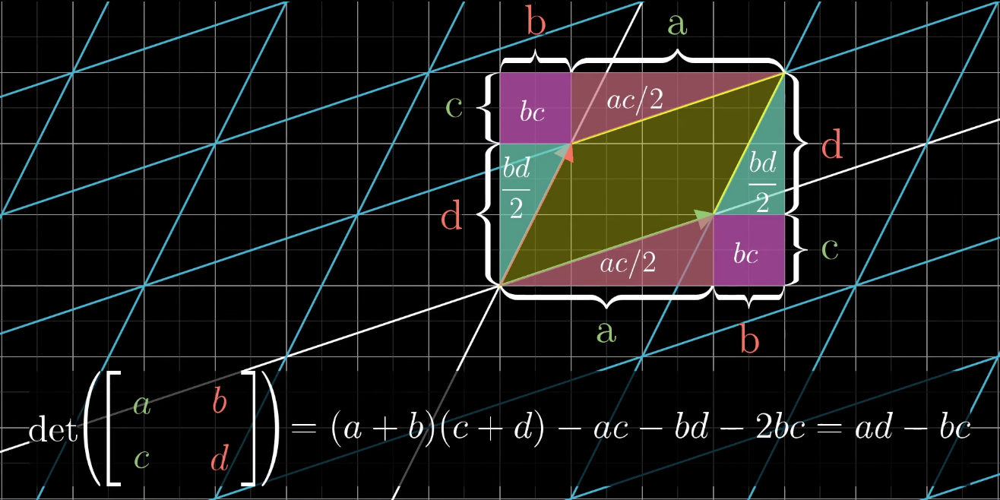
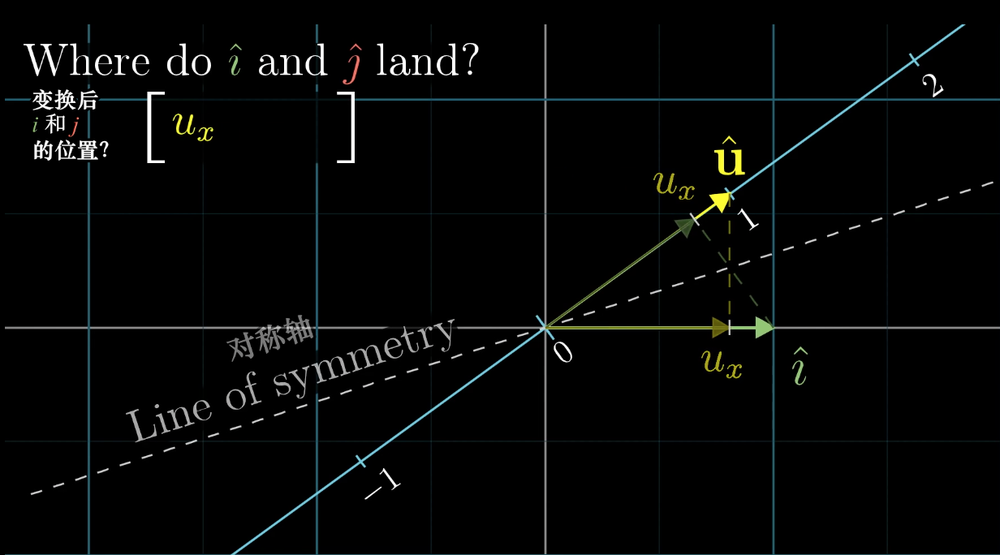

# 线性代数中的概念

[author]: # "Vonng (fengruohang@outlook.com)"
[tags]: # "数学，线性代数"
[mtime]: #	"2017-02-12 18:00"

用一种巧妙的线索串起了线性代数中涉及到的基本概念。

---

##  向量

向量有三种视角

1. 物理学视角：向量是一个有方向和大小的箭头
2. 计算机视角：向量是一个有序列表
3. 数学视角：向量是一个有序列表，可以容纳任何东西，只要向量加法与向量倍乘有意义。

## 线性空间，张成的空间与基

* $\mathbb{R}^2$中，两个不共线的向量可以组合出任何想要的向量。
* 而两个共线的向量只能组合出这条线上的向量。
* 更进一步， 两个零向量只能张出0向量。
* 将这两个向量并在一起，写成矩阵的形式。矩阵在这里就代表对空间的变换。
* 某个变换，将$\hat{i}$变化为$\left[\begin{matrix}a \\c\end{matrix}\right]$，将$\hat{j}$变化为$\left[\begin{matrix}b \\d\end{matrix}\right]$。于是这个变换可以写成矩阵$\left[\begin{matrix}a & b \\ c & d\end{matrix}\right]$
* 这两个向量，可以称为一组基，可以通过这两个向量组合得到的向量集合，称为这组基张成的空间。

## 矩阵乘法，线性变换的复合

* 既然矩阵可以看做线性变换，那么线性变换的复合等价于矩阵的乘法。

* 在这种视角下，矩阵乘法的结合律是不证自明的。$A(BC)=(AB)C$实质都是依次应用C、B、A三个线性变换。

  ​

## 行列式

* 在线性变换中，有一个指标可以衡量变换前后面积（体积）变化的程度。那就是行列式。
* $\mathbb{R}^2$中的线性变换，行列式的绝对值代表面积变化的倍数，而行列式的符号代表变换后的两个向量顺逆时针方向关系是否发生变换（即变换是否导致面积翻转）

$\mathbb{R}^3$中的线性变换，行列式的绝对值代表体积变化的倍率，符号则代表$\hat{i},\hat{j},\hat{k}$三者的手性是否发生了反转。
$$
det(\left[\begin{matrix} a & b & c  \\ d & e & f\\ g & h & i\end{matrix}\right]) = 
a det(\left[ \begin{matrix}e & f \\ h & i\end{matrix}\right])
- b det(\left[ \begin{matrix}d & f \\ g & i\end{matrix}\right])
+ c det(\left[ \begin{matrix}d & e \\ g & h\end{matrix}\right])
$$
如果一个矩阵（线性变换）的行列式值等于0，这意味着变换导致了维度下降，被压成线甚至点的变换面积自然为0，而压成面，线，点的$\mathbb{R}^3$线性变换矩阵的体积变化倍率也必然为0。

## 线性方程组

对于线性方程组而言，如果不包含诸如$xy,sin(x),e^x$等fancy function，只是简单的数乘变量之和组成的方程组，那么就可以用线性代数的方式来解。将线性方程组写成$Ax=v$的形式。则A称为系数矩阵，$\begin{matrix}[A& \vec{v}]\end{matrix}$称为增广矩阵。

当将A视作矩阵时，从线性变换的几何视角来看：这意味着线性变换$A$将向量$x$变换为向量$v$。从而当我们求解$x$时，实质是找出这个变换的逆变换，使之将向量$v$变换回向量$x$。即$A^{-1}Ax = x$，即$A^-1A=E$。引入单位矩阵，恒等变换的概念。从而$x = A^{-1}v$

任何线性变换A，都需要满足**将零向量映射为零向量**，所以齐次线性方程组$Ax=0$一定具有平凡解$x=\vec{0}$

## 矩阵代数，逆矩阵

什么样的变换有逆变换？试想一个变换将平面压缩至了一条线，那么没有任何变换可以挽回这一点（因为如果有变换能将一条线还原成一个面，就违背了函数单一输出的原则）。所以这样的变换没有逆。

**秩就是A线性无关列的数目**。因为A的列是目标空间的基，这组基能张出多高维数的空间，取决于这组基里线性无关的列的数目。这组基张成的空间，称为**列空间**。秩就是列空间的维度：将一个立方体变换成立方体，秩为3，压缩成平面，这样的矩阵秩为2，压缩成线，秩为1，压缩成0向量，秩为0。

秩少了1，会导致一条线上的向量被映射为0向量，秩少了2，会导致一个平面被压缩到0向量上。这个被线性变换映射到0向量的空间，称为**零空间**。或者线性变换的**核(kernel)**。

不满秩的变换矩阵T是**不可逆**的。因为这个变换导致了降维，无法还原。

A的行也可以看做向量，行向量的秩称为行秩。

## 非方阵

逆矩阵这样的事情，只能对方阵有意义，因为一个矩阵至少得是方阵，才能保证变换前后的维度不发生变换。所以非方阵并没有行列式。

比如，一个$2\times3$的矩阵，二行三列，就可以是一个三维空间到二维空间的映射。输入是一个三维向量，作为权重与矩阵的三个列向量进行线性组合，得到一个二维向量作为输出结果。

再比如，一个$1\times2$的矩阵，其实就是一个行向量，输入是一个二维向量，每个基向量都是一维的，也就是标量。这其实就从二维空间到一维数轴的线性变换。其实这就是**点积**

## 点积与对偶性

求两个维度相同的向量点积，是将对应维度的坐标相乘后求和得到的结果。
$$
\left[\begin{matrix}a \\ b\end{matrix}\right] \cdot \left[\begin{matrix}c \\ d\end{matrix}\right]
= ac + bd
$$
这是高中里的向量点积计算方式，但从来没说这样运算的理由何在

$\vec{a}\cdot \vec{b} = |a|\cdot|b|\cdot cos(\theta) = |a|\cdot(|b|cos(\theta))=|b|(|a|cos(\theta))$ 

但是我们不妨从矩阵乘法与线性变换的角度来看待点积，解释其几何意义。

对于矩阵和向量的乘法$\left[\begin{matrix} u_x& u_y \end{matrix}\right] \cdot \left[\begin{matrix} v_x \\ v_y \end{matrix}\right]$

第一个“向量”横过来，可以看做一个$1\times2$的矩阵，一个从$\mathbb{R}^2$到$\mathbb{R}$的线性映射。而$[u_x]$与$[u_y]$就是这个新空间的基向量，因为这两个向量是共线的，实际上就是两个标量。

新基数轴上的单位向量$\hat{u} = \frac{\vec{u}}{|u|}$的坐标为$(u_x, u_y)$，恰好是单位向量$\hat{i}, \hat{j}$在$\hat{u}$上的投影。

$\hat{i}$被映射为了标量$u_x$，而$\hat{j}$被映射为了标量$u_y$。

所以$\left[\begin{matrix} u_x& u_y \end{matrix}\right] \cdot \left[\begin{matrix} v_x \\ v_y \end{matrix}\right]=u_xv_x+u_yv_y$得到了新数轴下面的刻度值。

很奇妙的，矩阵与向量的乘法与向量点积有着一模一样的计算方式，这就说明了：

当把向量点积运算中的第一个向量看做线性变换矩阵时，这个线性变换将第二个向量投影到了列空间（数轴）中。投影得到的刻度乘以向量$\vec{u}$的长度就是点积的结果。

所以，一个二维到一维的线性变换，它除了可以用矩阵的形式来表达之外，还可以用向量点积的方式来表达。

推广：一个多维空间到一维空间的线性变换，其对偶（dual）是多维空间中的某个特定向量。

这一特性是因为，多维空间映射到数轴的线性变换，可以用一个只有一行的矩阵描述，这个矩阵的每一列给出了变换后基向量的位置。将这个矩阵与某个向量相乘在计算上与矩阵转置得到的向量与原向量点积的结果。

## 叉积

$\mathbb{R}^2$上的叉积得到一个标量，它的正负号指明了方向，计算方式等同于二维矩阵的行列式。但这是一个假象。真正的叉积定义在三维空间$\mathbb{R}^3$上。

##### 性质

与点积不同，叉积的结果是一个**向量**。$\vec{v} \times \vec{w} = \vec{p}$

该向量长度等于两向量张成的平行四边形面积，方向遵从右手法则。

##### 计算

通常采用计算三维矩阵的行列式来计算向量叉积。但采用行列式的方式进行叉积运算的计算仅仅是符号上的技巧，我们需要知道为什么行列式可以用来计算叉积？以及为什么要这样定义这样做。
$$
\left[\begin{matrix}v_1 \\ v_2 \\ v_3 \end{matrix}\right] 
\times
\left[\begin{matrix} w_1 \\ w_2 \\ w3 \end{matrix}\right]
= det(\left[\begin{matrix} \hat{i} & v_1 & w_1 \\ \hat{j} & v_2 & w_2\\ \hat{k} & v_3 & w_3 \end{matrix}\right])
\\=\hat{i}(v_2w_3-w_2v_3) + \hat{j}(v_3w_1-w_3v_1) + \hat{k} (v_1w_2-w_1v_2 )
$$
叉积的结果向量可以采用这种方式计算：
$$
\left[\begin{matrix}v_1 \\ v_2 \\ v_3 \end{matrix}\right] 
\times
\left[\begin{matrix} w_1 \\ w_2 \\ w3 \end{matrix}\right]
= \left[\begin{matrix}v_2w_3-w_2v_3 \\ v_3w_1-v_1w_3 \\ v_1w_2-w_1v_2 \end{matrix}\right]
$$
##### 为什么叉积具有这样的性质（几何意义）？                                                                                                                                                                                                                                                                                                                                                                                                                                                                                                                                                                                                                                                                                        

为了探明这个问题，分三步走：

* 构造一个函数$f(\vec{x}) = det(\left[\begin{matrix}\vec{x} & \vec{v} & \vec{w}\end{matrix}\right]) $。这个函数包含$\vec{v},\vec{w}$作为参数，以$\vec{x}$作为自变量。是一个三维向量到一维标量的映射。

$$
f(\left[\begin{matrix}x \\ y \\ z \end{matrix}\right] )
= det(\left[\begin{matrix} x & v_1 & w_1 \\ \ y & v_2 & w_2\\z& v_3 & w_3 \end{matrix}\right])
$$

​	之所以这么构造，是因为$\vec{v}\times\vec{w} = f(\left[\begin{matrix}\hat{i} \\ \hat{j} \\ \hat{k}\end{matrix}\right])$。当这个函数自变量取值为$\left[\begin{matrix}\hat{i} \\ \hat{j} \\ \hat{k}\end{matrix}\right]$时，计算结果正好是参数$\vec{v},\vec{w}$的叉积。

* 证明$f$是一个线性函数，所以$f(\vec{x})$等效于一个线性变换$M$。因为$f$接受一个三维向量，输出一个标量，所以这个矩阵一定是一个$1\times3$的扁矩阵$\begin{matrix}[p_1 & p_2 & p_3]\end{matrix}$。但又因为一个从3维到1维的线性变换可以等效为向量点积，这个扁矩阵可以竖起来改写成向量的形式$\left[\begin{matrix}p_1 \\ p_2 \\ p_3\end{matrix}\right]$。从而，矩阵乘法变成了与对偶向量的点积。

$$
f(\vec{x} )=x(v_2w_3-w_2v_3) + y(v_3w_1-w_3v_1) + z (v_1w_2-w_1v_2 )
\\
f(\vec{x})= \left[\begin{matrix}v_2w_3-w_2v_3 \\ v_3w_1-v_1w_3 \\ v_1w_2-w_1v_2 \end{matrix}\right] \cdot
\left[\begin{matrix}x \\ y \\ z \end{matrix}\right] \\
$$

$$
\vec{p} = \vec{v} \times \vec{w} 
= f(\left[\begin{matrix}\hat{i} \\ \hat{j} \\ \hat{k}\end{matrix}\right]) 
= \left[\begin{matrix}v_2w_3-w_2v_3 \\ v_3w_1-v_1w_3 \\ v_1w_2-w_1v_2 \end{matrix}\right] \cdot
\left[\begin{matrix}\hat{i} \\ \hat{j} \\ \hat{k}\end{matrix}\right]
= \left[\begin{matrix}v_2w_3-w_2v_3 \\ v_3w_1-v_1w_3 \\ v_1w_2-w_1v_2 \end{matrix}\right]
$$

这个向量$\vec{p}$，恰好是点积的计算方式。现在，我们要推出p确实具有这些性质。就需要利用到构造的函数$f$了。

* 因为$f(\vec{x}) = det(\left[\begin{matrix}\vec{x} & \vec{v} & \vec{w}\end{matrix}\right]) $。行列式的几何意义是这三个向量围起来的平行六面体体积。这里两个向量已经确定，第三个向量是自变量。又因为$f(\vec{x}) = \vec{p} \cdot \vec{x}$

  问题就来了，什么样的向量$\vec{p}$能够与自变量点积得到体积呢？

  体积 = 底面积 x 高

  $V = \vec{p}\cdot\vec{x} =|p||x|cos(\theta) =  hS $

  当向量$p$垂直于底面时，$|x|cos\theta$ 为落在高上的投影，等于高。此时$|p| = S$

## 基变换

任何发生在一组数与向量之间的转化，都被称为一个**坐标系**

坐标，只有通过坐标系（隐含的坐标系$(\hat{i},  \hat{j})$）的转化，才能与向量空间建立联系。

坐标系，是通过对基向量的选取建立的。同样的一个坐标[1,2]，在两个坐标系中，可能指代的是不同的向量。

坐标系矩阵，由坐标系的基向量作为列向量排列而成，这些基向量的坐标采用我们眼中的坐标，也就是隐含坐标系$(\hat{i},\hat{j})$。坐标系矩阵 乘以 坐标向量，得到我们眼中的坐标。

反过来，如果希望把我们眼中的坐标翻译成特定坐标系的坐标。那么用坐标系矩阵的逆乘以我们眼中的坐标向量即可。

所以形如：$B= Q^{-1}AQ$的项暗示着一种数学上的转移作用：首先线性变换A发生在我们的坐标系中，而Q是另外一个坐标系矩阵。则B实际上是用另一个坐标系进行描述的线性变换。它接受另一个坐标系中的坐标，应用同样的变换，然后仍然返回另一个坐标系中的坐标。

这也是相似矩阵的意义。物理变化是同一个，只不过采用了不同的坐标系来描述。

## 特征向量与特征值

当矩阵变换可以看做线性变换之后，特征向量与特征值的几何意义就变得十分直接。

变换$x \mapsto Ax $ 可能使向量往各个方向移动，但通常会有一些特殊向量，A对这些向量只是简单的拉伸压缩（倍乘）。
$$
A\vec{v} = \lambda\vec{v}
$$
这里，$\vec{v}$是特征向量，而$\lambda$是特征值。即变换对特征向量的作用等于倍乘特征值。

因为倍乘$\lambda$也可以用矩阵$\lambda E$来表示，所以$(A-\lambda E)\vec{v} = \vec{0}$

这实际上是求解使得$det(A-\lambda E) = 0$的$\lambda$值，并求解此时该方程的非零解。

因为这是一个系数阵线性相关的齐次方程组，所以肯定存在非零解。

* 对于一些矩阵，比如旋转，每个向量都被扭到新的位置上去了，这时候实数域上的特征值是不存在的。也就是说没有对应的特征向量。（然而有复数特征值）
* 对于另一些线性变换，比如剪切，可能会出现只有一个特征值一个特征向量。
* 也存在只有一个特征值，但特征向量有无穷多个，例如$x \mapsto \lambda E x$

##### 特征基	

描述线性变换可以采用不同的坐标系，如果坐标系使用的基正好是特征向量会发生什么？

如果我们用特征向量拼出了一个坐标系矩阵Q，那么在这个坐标系中，该线性变换的作用，恰好就表示为对几个基向量的倍乘，所以在这个坐标系中，线性变换表示为对角矩阵。这个对角阵对角线上的各项，就是对应特征向量的特征值。
$$
A = Q^{-1}
\left[\begin{matrix} 
 \lambda_{1} & 0 & \cdots & 0\\ 
 0 & \lambda_2 & \cdots & 0 \\
 \vdots & \vdots & \ddots & \vdots\\
 0 & 0 & \cdots & \lambda_n
 \end{matrix}\right]
Q
$$
这个就是**相似对角化**

进行相似对角化的前提是，你能选择出足够张成整个空间的特征向量来。

## 向量空间

向量可以是各种各样的东西，只要它们具有向量的特性(vectorish things)，例如函数。

如果我们令坐标系的基向量，不再是$\hat{i}, \hat{j}$，而是多项式$x^0,x^1,x^2,…,x^n$

那么，定义在多项式空间上的代数运算，即，变换，也可以用矩阵来表示。

例如多项式求导运算，就可以写作一个矩阵。

向量的定义，是一个接口。任何满足向量8条公理的东西，都可以被线性代数的结论处理。