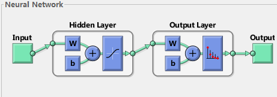

# 神经网络概念

[author]: # "Vonng (fengruohang@outlook.com)"
[tags]: # "神经网络，数学"
[category]: # "math/nndl"
[mtime]: #	"2017-04-19 18:00 "
神经网络相关基本概念，来自《神经网络设计》与《NNDL》

---


## 神经元模型

神经元(neuron)是构成神经网络的基本单位。神经网络是从大脑的工作原理得到启发的。
人脑中的神经元具有一个轴突和多个树突，每个树突都是一个输入，当所有树突的输入兴奋程度超过某一阈值，神经元就会被激活，沿着轴突发射出信号，产生输出。



如图所示，一个神经元的数学模型包括以下内容：

| 名称                         | 符号   | 说明                         |
| -------------------------- | ---- | -------------------------- |
| 输入 (input)                 | $x$  | 列向量                        |
| 权值 (weight)                | $w$  | 行向量，维度等于输入个数               |
| 偏置 (bias)                  | $b$  | 标量值，是阈值的相反数                |
| 带权输入 (weighted input)      | $z$  | $z=w · x + b$ ，激活函数的输入值    |
| 激活函数 (activation function) | $σ$  | 接受带权输入，给出激活值。              |
| 激活值 (activation)           | $a$  | $a = σ(\vec{w}·\vec{x}+b)$ |

激活函数通常使用S型函数：又称为sigmoid或者logsig，因为该函数具有良好的特性：光滑可导，形状接近感知机所使用的硬极限传输函数，函数值与导数值计算方便。
$$
σ(z) = \frac 1 {1+e^{-z}}
$$

$$
σ' = z(1-z)
$$

也有一些其他的激活函数，例如：硬极限传输函数(hardlim)，对称硬极限函数(hardlims)，线性函数(purelin) ， 对称饱和线性函数(satlins) ，对数-s形函数(logsig)  ，正线性函数(poslin)，双曲正切S形函数(tansig)，竞争函数(compet)，有时候为了学习速度或者其他原因也会使用，这里表过不提。


## 神经网络模型（单层）

可以并行操作的神经元组成的集合，称为神经网络的一层。

现在考虑一个神经网络的某一层，该层由$s$个神经元组成。对原来单个神经元的数学模型进行扩展：
| 名称   | 符号   | 说明                                       |
| ---- | ---- | ---------------------------------------- |
| 输入   | $x$  | 列向量，保持不变。维度为N                            |
| 权值   | $W$  | 由一个N维行向量，变为S个N维行向量组成的矩阵W，维度为SxN          |
| 偏置   | $b$  | 由一个标量值，变为一个S维列向量。                        |
| 带权输入 | $z$  | $z=Wx + b$ ，同样由标量变为S维列向量，无偏权值和计算方式，由点积变为矩阵乘法。 |
| 激活函数 | $σ$  | 由接受标量给出标量，变为接受带权输入$\vec{z}$列向量，给出激活值列向量$\vec{a}$ |
| 激活值  | $a$  | $a = σ(W\vec{x}+\vec{b})$ ，同$b,z$，由标量值变为S维列向量。 |

对于具有$s$个神经元，$n$个输入的单层神经网络，其计算逻辑可表示为：
$$
\left[ \begin{array}{a} a_1 \\ \vdots \\ a_s \end{array}\right]
= \sigma(
 	\left[ \begin{matrix} 
 		w_{1,1} & \cdots  & w_{1,n} \\  
 		\vdots & \ddots  & \vdots  \\ 
 		w_{s,1} & \cdots  & w_{s,n} \\  
 	\end{matrix}\right]  \cdot
 	
 	\left[ \begin{array}{x} x_1 \\ \vdots \\ \vdots \\ x_n \end{array}\right] + 
 	\left[ \begin{array}{b} b_1 \\ \vdots \\ b_s \end{array}\right]
)
$$


## 神经网络模型（多层）

假设有一个$L$层的神经网络，每一层的神经元个数依次为：$l_1,l_2,\dots,l_L$。

神经网络的层数从1开始数，第一层为**输入层**，第L层为**输出层**，其它层称为**隐含层**。

每一层神经网络都有自己的参数$x,W,b,z,a$，为了区别，使用上表标记层数：$W^2,W^3,\dots$。不过

第一层作为输入层，只有激活值$a^1$，没有其他的参数。


## 神经网络的前馈

**前馈（feed forward）**，是指神经网络接受输入，产生输出的一次过程。又称为一次**推断（inference）**。计算过程如下：
$$
\begin{align}
a^1  &= x \\
a^2  &=  σ(W^2a^1 + b^2) \\
a^3  &=  σ(W^3a^2 + b^3) \\
\cdots \\
a^L  &= σ(W^La^{L-1} + b^L) \\
y  &= a^L \\
\end{align}
$$


## 神经网络的训练

如何利用神经网络推断是很简单的，难点在于**如何调整神经网络的参数**。

通常使用梯度下降(Gradient Descent)的方法来调整神经网络的参数。


### 梯度下降(Gradient Descent) 

通常可以利用梯度下降的方法进行学习。利用梯度下降方法， 首先要定义一个代价函数，表示神经网络的误差，然后通过调整参数来**最小化**这个误差，实现参数的选择。 

#### 代价函数

最常用的代价函数是：**二次代价函数**，又称为**均方误差(MeanSquareError)**
$$
C(w,b) = \frac{1}{2n} \sum_x{{||y(x)-a||}^2}
$$
之所以使用二次代价而不是直接使用诸如“正确分类图像个数”作为代价函数，是因为我们需要一个平滑可导的函数作为代价函数，才可以通过**梯度下降法**，来调整网络中的参数。

#### 梯度下降

神经网络的参数浩瀚如烟，通过微积分求偏导来算梯度是不现实的。

假设我们希望调整神经网络中的某个参数，因为每层的激活函数都是光滑可导的。所以轻微调整某个参数的值，最终的误差值也会发生连续的轻微的变化。不断地轻微改变每个参数的值，使得最终总误差值向下降的方向前进，最终达到极值点。这就是梯度下降法的核心思路。

#### 具体细节

现在假设代价函数$C$为两个变量$v1,v2$的可微函数，梯度下降，实际上就是选择合适的$\Delta v$，使得$\Delta C$为负。由微积分可知：
$$
\Delta C \approx \frac{\partial C}{\partial v_1} \Delta v_1 +
  \frac{\partial C}{\partial v_2} \Delta v_2
$$
这里$\Delta v$是向量：$\Delta v = \left[ \begin{array}{v}  \Delta v_1 \\ \Delta v_2 \end{array}\right]$，$\Delta C$是梯度向量$\left[ \begin{array}{C} \frac{\partial C}{\partial v_1} \\ \frac{\partial C}{\partial v_2} \end{array} \right]$，于是上式可重写为
$$
\Delta C \approx \nabla C \cdot \Delta v
$$
那么怎样选择$\Delta v$才能令代价函数的变化量为负呢？一种简单办法是令$\Delta v = -\eta \nabla C$
$$
\Delta C \approx  - \eta {\nabla C}^2
$$
即令$\Delta v$取一个与梯度$\nabla C$共线反向的小向量，表示自变量前进的方向。

通过不断地调整$v$：$v \rightarrow v' = v -\eta \nabla C$，使得$C$获得一个全局的最小值。

对于神经网络，学习的参数实际上是权重$w$与偏置量$b$。不过这里的$w,b$数目非常巨大
$$
w_k \rightarrow w_k' = w_k-\eta \frac{\partial C}{\partial w_k} \\
b_l \rightarrow b_l' = b_l-\eta \frac{\partial C}{\partial b_l}
$$

这里使用的代价函数是MSE，是每一个训练样本误差平方的**均值**。但训练样本非常多，如果每次训练都要重新计算误差函数，开销是很大的。如果每次训练只使用所有训练样本的一小部分，就会快很多。这依赖一个假设：**不同随机样本计算得到的MSE，近似等于总体的MSE。**

常用的梯度下降法有：

- 批量梯度下降法(Batch GD)：最原始的形式，更新每一参数都使用所有样本。可以得到全局最优解，易于并行实现，但当样本数量很多时，训练速度极慢。


- 随机梯度下降法(Stochastic GD)：解决BGD训练慢的问题，每次随机使用一个样本。训练速度快，但准确度下降，且并不是全局最优，也不易于并行实现。
- 小批量梯度下降法MBGD：在每次更新参数时使用b个样本（例如每次10个样本），在BGD与SGD中取得折中。
- 每次使用一个样本时，SGD又称为在线，online，递增学习。


#### 问题与挑战

应用梯度下降算法时，问题的难点在于：**如何计算梯度？** 

反向传播算法可以解决这一问题，将在下一章独立讨论。


## 神经网络样例

这里给出一个神经网络应当有的结构(Python)

```python
# coding: utf-8
import numpy as np
import random


def sigmoid(z):
    """激活函数logsig"""
    return 1.0 / (1.0 + np.exp(-z))


def sigmoid_prime(z):
    """激活函数的导数"""
    return sigmoid(z) * (1 - sigmoid(z))


class Network(object):
    def __init__(self, sizes):
        ''' Usage:  net = Network([2,3,1])'''

        # 按照给定尺寸初始化一个多层神经网络，这里有3层。每层分别有2，3，1个神经元
        self.num_layers = len(sizes)
        self.sizes = sizes
        # weights[0]其实是第二层的权值矩阵。每个权值矩阵行数由本层的神经元数指定
        # 每个权值矩阵的列数由本层的输入个数，即上一层的神经元数指定。
        self.weights = [np.random.randn(neuron_size, input_size)
                        for input_size, neuron_size in zip(sizes[:-1], sizes[1:])]
        # 第一层网络只有激活值，没有偏置与权值。所以biases[0]其实是第二层的偏置向量。
        self.biases = [np.random.randn(neuron_size, 1)
                       for neuron_size in sizes[1:]]

    def feed_forward(self, a):
        '''进行一次前馈计算'''
        # 输入的值a是第一层(输入层)的激活值向量，应当为sizes[0] x 1的列向量
        for w, b in zip(self.weights, self.biases):
            a = sigmoid(np.dot(w, a) + b)
        return a

    def SGD(self, train_data, epoches, m, eta, test_data=None):
        """
            输入训练数据集，调整神经网络参数的核心方法
            train_data:     用于评估的数据集[(x,y),...]
            epoches:        迭代周期数
            m:              样本小批量尺寸
            eta:            学习速率
            test_data:      测试数据集，用于评估效果
        """
        n = len(train_data)
        for round in xrange(epoches):
            # 每一轮迭代时，将训练集划分为大小为m的的Mini batch
            random.shuffle(train_data)
            # 用每个小批样本更新一次参数
            for mini_batch in [train_data[k:k + m] for k in xrange(0, n, m)]:
                self.update_mini_batch(mini_batch, eta)

            # 如果提供了测试集，每轮迭代结束时将评估其表现。
            if test_data:
                print "Epoch {0}: {1}/{2}".format(
                    round, self.evaluate(test_data), len(test_data))
            else:
                print "Epoch {0} complete".format(round)

    def update_mini_batch(self, mini_batch, eta):
        # 按照b,w的形状初始化权值偏置的梯度： ∇w,∇b
        nabla_w = [np.zeros(w.shape) for w in self.weights]
        nabla_b = [np.zeros(b.shape) for b in self.biases]

        # 对于小批量中的每个样本，都要进行一次反向传播
        for x, y in mini_batch:
            # 使用反向传播算法计算∇b, ∇w的修正值Δ∇w, Δ∇b
            delta_nabla_w, delta_nabla_b = self.back_propation(x, y)

            # 将修正值应用到梯度上∇w, ∇b
            nabla_w = [nw + delta_nw for nw,
                       delta_nw in zip(nabla_w, delta_nabla_w)]
            nabla_b = [nb + delta_nb for nb,
                       delta_nb in zip(nabla_b, delta_nabla_b)]

        n = len(mini_batch)
        # 计算得到梯度后，乘以学习速率再除以样本数量，应用至网络的参数b,w 上。
        self.weights = [w - (eta / n) * nw
                        for w, nw in zip(self.weights, nabla_w)]
        self.biases = [b - (eta / n) * nb
                       for b, nb in zip(self.biases, nabla_b)]

    def evaluate(self, test_data):
        """对测试集进行预测，返回成功预测的数目"""
        test_results = [(np.argmax(self.feed_forward(x)), y)
                        for x, y in test_data]
        return sum(int(x == y) for (x, y) in test_results)

    def back_propation(self, x, y):
        """Magic Here"""
        # TODO: 反向传播算法，接受一个打标样本(x,y),返回所有参数的梯度(调整量) Δ∇b, Δ∇w，
        # return np.zeros(w.shape), np.zeros(b.shape)

        nabla_w = [np.zeros(w.shape) for w in self.weights]
        nabla_b = [np.zeros(b.shape) for b in self.biases]

        # 逐层前馈
        activation = x
        activations = [x]  # 保存每层的激活值a。第一层的激活值就是输入x
        zs = []            # 保存每层的带权输入z，第一层没有
        for b, w in zip(self.biases, self.weights):
            z = np.dot(w, activation) + b   # 计算并保存带权输入
            zs.append(z)
            activation = sigmoid(z)  # 计算并保存激活值
            activations.append(activation)

        # 反向传播
        delta = (activations[-1] - y) * sigmoid_prime(zs[-1])  # 最后一层的误差
        nabla_b[-1] = delta
        nabla_w[-1] = np.dot(delta, activations[-2].transpose())
        for l in xrange(2, self.num_layers):
            z = zs[-l]
            sp = sigmoid_prime(z)
            delta = np.dot(self.weights[-l + 1].transpose(), delta) * sp
            nabla_b[-l] = delta
            nabla_w[-l] = np.dot(delta, activations[-l - 1].transpose())
        return (nabla_w, nabla_b)


if __name__ == '__main__':
    import mnist_loader
    train_data, valid_data, test_data = mnist_loader.load_data_wrapper()
	# 输入为图片，格式为784维的向量(0-255)，所以输入层(第一层)具有784个神经元
	# 输出为分类结果向量，手写数字的分类结果一共有十种(0-9)，所以输出层(第三层)有10个神经元。
    dim = [784, 100, 10]
    net = Network(dim)
    
    # 训练一个神经网络: 
    net.SGD(train_data, 30, 10, 3.0, test_data)
```
