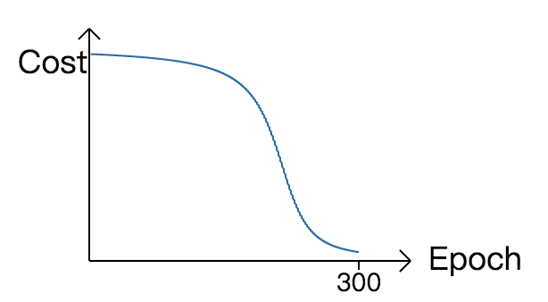
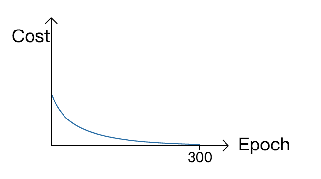
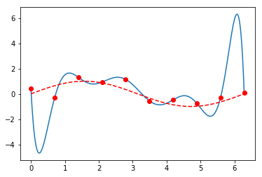

# 神经网络优化

[author]: # "Vonng (fengruohang@outlook.com)"
[tags]: # "神经网络，数学"
[category]: # "math/nndl"
[mtime]: #	"2017-05-11 10:00 "
神经网络基础进阶，优化手段导论

---


神经网络的基础知识不多，但优化其表现却是一个无尽的挑战。每一种优化的手段都可以当做一个进阶的课题深入研究。改进神经网络的学习效果有几种主要的方法：

- 选取**更好的代价函数**：例如**交叉熵（cross-entropy）**
- **规范化（regularization）**：**L2规范化**、弃权、L1规范化
- 采用其他的**激活神经元**：线性修正神经元（ReLU），双曲正切神经元（tansig）
- 修改神经网络的输出层：**柔性最大值(softmax)**
- 修改神经网络输入的组织方式：递归神经网络（Recurrent NN），卷积神经网络（Convolutional NN）。
- 添加层数：深度神经网络（Deep NN）
- 通过尝试，选择合适的**超参数（hyper-parameters）**，按照迭代轮数或评估效果动态调整超参数。
- 采用其他的梯度下降方法：基于动量的梯度下降
- 使用更好的**初始化权重**
- 人为扩展已有训练数据集


## 代价函数：交叉熵

MSE是一个不错的代价函数，然而它存在一个很尴尬的问题：学习速度。

MSE输出层误差的计算公式为：
$$
δ^L =  (a^L - y)σ'(z^L)
$$
sigmoid又称为逻辑斯蒂曲线，其导数$σ'$是一个钟形曲线。所以当带权输入$z$从大到小或从小到大时，梯度的变化会经历一个“小，大，小”的过程。学习的速度也会被导数项拖累，存在一个“慢，快，慢”的过程。

| MSE                 | Cross Entropy                 |
| ------------------- | ----------------------------- |
|  |  |

若采用**交叉熵（cross entropy）**误差函数：
$$
C = - \frac 1 n \sum_x [ y ln(a) + (1-y)ln(1-a)]
$$
对于单个样本，即
$$
C = - [ y ln(a) + (1-y)ln(1-a)]
$$
虽然看起来很复杂，但输出层的误差公式变得异常简单，变为：$δ^L =  a^L - y$ 

比起MSE少掉了导数因子，所以误差直接和（预测值-实际值）成正比，不会遇到学习速度被激活函数的导数拖慢的问题，计算起来也更为简单。

#### 证明

$C$对网络输出值$a$求导，则有：

$$
∇C_a = \frac {∂C} {∂a^L} = - [ \frac y a - \frac {(1-y)} {1-a}] = \frac {a - y} {a (1-a)}
$$

反向传播的四个基本方程里，与误差函数$C$相关的只有BP1：即输出层误差的计算方式。

$$
δ^L = ∇C_a ⊙ σ'(z^L)
$$

现在$C$换了计算方式，将新的误差函数$C$对输出值$a^L$的梯度$\frac {∂C} {∂a^L}$带回BP1，即有：

$$
δ^L = \frac {a - y} {a (1-a)}× a(1-a) = a-y
$$


### 规范化

拥有大量的自由参数的模型能够描述特别神奇的现象。

费米说："With four parameters I can fit an elephant, and with five I can make him wiggle his trunk"。神经网络这种动辄百万的参数的模型能拟合出什么奇妙的东西是难以想象的。

一个模型能够很好的拟合已有的数据，可能只是因为模型中足够的自由度，使得它可以描述几乎所有给定大小的数据集，而不是真正洞察数据集背后的本质。发生这种情形时，**模型对已有的数据表现的很好，但是对新的数据很难泛化**。这种情况称为**过拟合（overfitting）**。

例如用3阶多项式拟合一个带随机噪声的正弦函数，看上去就还不错；而10阶多项式，虽然完美拟合了数据集中的所有点，但实际预测能力就很离谱了。它拟合的更多地是数据集中的噪声，而非数据集背后的潜在规律。

```python
x, xs = np.linspace(0, 2 * np.pi, 10), np.arange(0, 2 * np.pi, 0.001)
y = np.sin(x) + np.random.randn(10) * 0.4
p1,p2 = np.polyfit(x, y, 10), np.polyfit(x, y, 3)
plt.plot(xs, np.polyval(p1, xs));plt.plot(x, y, 'ro');plt.plot(xs, np.sin(xs), 'r--')
plt.plot(xs, np.polyval(p2, xs));plt.plot(x, y, 'ro');plt.plot(xs, np.sin(xs), 'r--')
```

| 3阶多项式                     | 10阶多项式                     |
| ------------------------- | -------------------------- |
|  |  |

一个模型真正的测验标准，是它对没有见过的场景的预测能力，称为**泛化能力（generalize）**。

如何避免过拟合？按照奥卡姆剃刀原理：**因不宜超出果之需**，或者用其它的方式来表述：**最简单的解释是最佳的。**

当然这个原理只是我们抱有的一种信念，并不是真正的定理铁律：这些数据点真的由拟合出的十阶多项式产生，也不能否认这种可能…

总之，如果出现非常大的权重参数，通常就意味着过拟合。例如拟合所得十阶多项式系数就非常畸形：

```
 -0.001278386964370502
 0.02826407452052734
 -0.20310716176300195
 0.049178327509096835
 7.376259706365357
 -46.295365250182925
 135.58265224859255
 -211.767050023543
 167.26204130954324
 -50.95259728945658
 0.4211227089756039
```

通过添加权重衰减项，可以有效遏制过拟合。例如$L2$规范化为损失函数添加了一个$\frac λ 2 w^2$的惩罚项：

$$
C = -\frac{1}{n} \sum_{xj} \left[ y_j \ln a^L_j+(1-y_j) \ln
  (1-a^L_j)\right] + \frac{\lambda}{2n} \sum_w w^2
$$

所以，权重越大，损失值越大，这就避免神经网络了向拟合出畸形参数的方向发展。

这里使用的是交叉熵损失函数。但无论哪种损失函数，都可以写成：

$$
C = C_0 + \frac {λ}{2n} \sum_w {w^2}
$$

其中原始的代价函数为$C_0$。那么，原来损失函数对权值的偏导，就可以写成：

$$
\frac{∂C}{∂w} = \frac{ ∂C_0}{∂w}+\frac{λ}{n} w
$$

因此，引入$L2$规范化惩罚项在计算上的唯一变化，就是在处理权值梯度时首先要乘一个衰减系数：

$$
w → w' = w\left(1 - \frac{ηλ}{n} \right) - η\frac{∂C_0}{∂ w}
$$

注意这里的$n$是所有的训练样本数，而不是一个小批次使用的训练样本数。


#### 改进实现

```python
# coding: utf-8
# author: vonng(fengruohang@outlook.com)
# ctime: 2017-05-10

import random
import numpy as np

class Network(object):
    def __init__(self, sizes):
        self.sizes = sizes
        self.L = len(sizes)
        self.layers = range(0, self.L - 1)
        self.w = [np.random.randn(y, x) / np.sqrt(x) for x, y in zip(sizes[:-1], sizes[1:])]
        self.b = [np.random.randn(x, 1) for x in sizes[1:]]

    def feed_forward(self, a):
        for l in self.layers:
            a = 1.0 / (1.0 + np.exp(-np.dot(self.w[l], a) - self.b[l]))
        return a

    def gradient_descent(self, train, test, epoches=30, m=10, eta=0.1, lmd=5.0):
        n = len(train)
        for round in range(epoches):
            random.shuffle(train)
            for batch in [train_data[k:k + m] for k in xrange(0, len(train), m)]:
                x = np.array([item[0].reshape(784) for item in batch]).transpose()
                y = np.array([item[1].reshape(10) for item in batch]).transpose()
                r = eta / len(batch)
                w = 1 - eta * lmd / n

                a = [x]
                for l in self.layers:
                    a.append(1.0 / (np.exp(-np.dot(self.w[l], a[-1]) - self.b[l]) + 1))

                d = (a[-1] - y)  # cross-entropy    BP1
                for l in range(1, self.L):
                    if l > 1: 	# BP2
                        d = np.dot(self.w[-l + 1].transpose(), d) * a[-l] * (1 - a[-l])
                    self.w[-l] *= w  # weight decay
                    self.w[-l] -= r * np.dot(d, a[-l - 1].transpose())  # BP3
                    self.b[-l] -= r * np.sum(d, axis=1, keepdims=True)  # BP4

            acc_cnt = sum([np.argmax(self.feed_forward(x)) == y for x, y in test])
            print "Round {%d}: {%s}/{%d}" % (round, acc_cnt, len(test_data))

            
if __name__ == '__main__':
    import mnist_loader
    train_data, valid_data, test_data = mnist_loader.load_data_wrapper()
    net = Network([784, 100, 10])
    net.gradient_descent(train_data, test_data, epoches=50, m=10, eta=0.1, lmd=5.0)
```

```
Round {0}: {9348}/{10000}
Round {1}: {9538}/{10000}
Round {2}: {9589}/{10000}
Round {3}: {9667}/{10000}
Round {4}: {9651}/{10000}
Round {5}: {9676}/{10000}
...
Round {25}: {9801}/{10000}
Round {26}: {9799}/{10000}
Round {27}: {9806}/{10000}
Round {28}: {9804}/{10000}
Round {29}: {9804}/{10000}
Round {30}: {9802}/{10000}
```

可见只是简单的变更，就使准确率有了显著提高，最终收敛至98%。

修改Size为`[784,128,64,10]`添加一层隐藏层，可以进一步提升测试集准确率至98.33%，验证集至98.24%。

对于MNIST数字分类任务，目前最好的准确率为99.79%，那些识别错误的case，恐怕人类想要正确识别也很困难。神经网络的分类效果最新进展可以参看这里：[classification_datasets_results](http://rodrigob.github.io/are_we_there_yet/build/classification_datasets_results.html)。

本文是tensorflow官方推荐教程：[Neural Networks and Deep Learning](http://neuralnetworksanddeeplearning.com/)的笔记整理，原文[Github Page](https://github.com/Vonng/Math/blob/master/nndl/nn-intro.md)。

