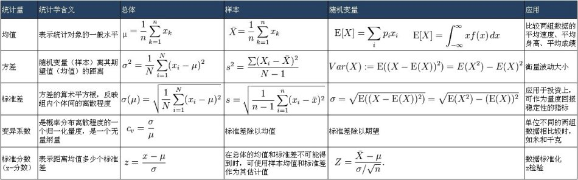

# 描述统计

[author]: # "Vonng (fengruohang@outlook.com)"
[tags]: # "统计，数学"
[mtime]: #	"2017-03-20 14:00 "
《心理统计——行为科学统计导论》第一至第七章读书笔记，描述统计部分。


## 1. 统计与科学方法

### 认识方法
历史上，人类主要采用：权威，理性主义，直觉与科学方法获取知识 
* 权威（Authority）：基于传统或者一些权威人士的意见获取知识
* 理性主义（rationalism）：通过推理获取知识，但是对于判定命题的真假，推理是不够的
* 直觉（intuition）：直觉是突然的顿悟，是涌入意识的突然想法。
* 科学方法（Scientific Method）：使用推理和直觉获取真理，但对于客观评价依靠实验与统计方法

### 术语定义
* **总体（Population）**：调查者在研究中感兴趣的个体，物体或者分数的完整集合。总体是参与实验的被试来自的群体。
* **样本（Sample）**：样本是总体的一个子集
* **变量（variable）**：某种事件、物体或个体的任何特征或者特性由于条件的变化，在不同的事件会发生变化，这种特性成为变量。
* **自变量（Independent Variable,IV）**：自变量是指实验中由研究者系统操作的变量。
* **应变量（Dependent Variable，DV）**：因变量指实验中研究者为确定自变量的效果而测量的变量
* **数据（data）**：数据是指对实验被试的测量结果。通常由因变量的测量结果和其他的被试特征构成。最初测得的数据被称为原始分
* **统计量（statistic）**：是指基于样本数据统计出来的数值，它是样本特征的数量表述。（如：样本的平均值是统计量）
* **参数（parameter）**：是指基于总体数据计算出的数值，它是总体特征的数量表述。

### 科学研究和统计
科学研究可以分为观察研究和真实验研究两类。
* 观察研究：在研究中变量不受研究者的主观操控，因此无法确定变量间的因果关系。包括自然观察，参数估计、相关研究。
* 真实验研究：研究者操纵某个自变量， 研究其对因变量的影响。
* **只有真实验研究才能确定因果关系**

### 描述统计与推断统计
* 统计分析分为**描述统计**与**推断统计**两个领域。
* **描述统计（Descriptive Statistics）**是关于对已有数据进行描述或表征的技术
* **推断统计（Inferential Statistics）**是关于利用已有样本数据对总体进行推断的技术。


## 2. 测量的基本概念

### 测量量表（Scale）
统计是处理数据的过程，数据是测量的结果，我们通过**测量量表（Scale）**来收集数据。

#### 称名量表（nominal scale）
称名量表是最低水平的测量量表，只针对定性变量。
称名量表的使用过程中，变量被划分成了几个**类别（category）**
称名量表的测量实际是对研究对象进行分类，并给其所属类别命名的过程。
称名量表的根本特性是等价性，某个类别中的所有成员都是一样的，其作用仅限于将物体分配到互不相容的各个类别中。
使用称名量表，不能进行加减乘除比例运算，不可进行顺序比较。
例子：{苹果，草莓，香蕉}

#### 顺序量表（ordinal scale）
顺序量表是次低水平的测量量表，具有低水平的量化水平。
顺序列表中的测量值具有基础的序关系，可以说明变量的相对关系，但无法说明变量的绝对水平。
使用顺序列表，可以进行顺序比较，不可进行加减乘除比例运算
例子：{差，中，好，很好}

#### 等距量表（interval scale）
等距量表是更高水平的测量量表，具有定量特性，每两个相邻单位之间等距，但没有绝对零点。
使用等距量表，可以进行顺序比较，进行加减运算，无法进行乘除运算。
例子：摄氏温标

#### 比率量表（ratio scale）
比率量表是最高水平的量表，具有定量特性与绝对零点。
比率量表可以进行所有的基础数学运算。
例子，开氏温标，数轴。


### 连续型和离散型变量
* **连续变量（continuous variable）**指量表中相邻单元间存在无限个可能值的变量类型
* **离散变量（discrete variable）**指量表中相邻单元间不存在无限个可能值的变量类型

* **连续变量的精确界限（real limit of a continuous variable）**
  由于连续变量的相邻单元之间存在无限个可能值，那么对一个连续变量的所有测量就是近似测量。
  连续变量的精确界限是指以量表最小测量单元为单位，记录数值加减二分之一单位的数值。
  例如，重量最小测量单位为1磅，测记录值为180磅时，其精确界限为180±0.5 pound

* **有效数字**
  物理中运算结果的有效数字应当与原始数据保持一致。

#### 四舍五入
没那么简单，尤其要注意余数为1/2的corner case。
规则如下：
1. 将四舍五入之数分为两部分，**潜在答案**与**余数**。**潜在答案**是扩展至小数位的数字。3.1245 = 3.12 + 0.045;**余数**是数字的剩余部分。
2. 在余数第一个数字前添加小数点，与1/2 比较。 0.045 -> 0.45
3. 如果该余数大于1/2，则潜在答案末尾数位+1，若小于则不变
4. 若该余数恰好等于1/2，则看潜在答案末尾是奇数还是偶数。奇数+1，偶数不变
```
45.04500≈45.04≠45.05
45.05500≈45.06
```

口诀：四舍六入五取偶
这种四舍五入方法，叫做银行家舍入法（Banker's rounding），是国际通行舍入方法。（IEEE754）
是.NET的默认实现，但python的round方法和Js的toFixed方法都不符合这个舍入方法。


## 3. 次数分布

### 数值分组
当数值量大而且分布广泛时，如果单独按数值列表会导致很多次数为0的情况出现。这种情况下，通常是**将单独数值归入各区间**，以分组数据次数分布的形式呈现。

数据分组是一个很重要的工作。其中的一个重要问题就是确定区间的宽度，只要**对数据分组，一定会损失一定量的信息**，区间越宽，信息损失越多。我们就无法知道数据在区间内是如何分布的，因此数据越宽，模糊性越大；然而区间越窄，所呈现数据虽然越接近原始数据，极端的例子就是区间大小仅有一个单位宽度，那么就回到了单独数值。所以单独数值的问题又回来了：很多次数为0的数值点。所以**区间越窄，难以清晰地显示分布的形态和集中趋势**

#### 绘制分组次数分布
绘制分组次数分布，步骤如下：
1. 求数据的**全距**
   - 全距=最大值-最小值
2. 确定每一分区的**组距**
   - 组距=全距/分组数
   - 分组数一般取10
3. 列出**分组区间**
   - 从最小区间开始，先确定该区间的最小下限。
   - 该区间的最小下限必须包含最小值
   - 该区间的最小下限习惯上可以被**组距**整除
4. 登记数值，对每一区间计数。

#### 相对次数分布、累积次数分布、累积百分比分布
* **相对次数分布(relative frequency distribution)**是指各分组区间中的数值次数占数值总次数的比例。

* **累计次数分布(cumulative frequency distribution)**是指**各分组区间精确上限以下**数值的次数。

* **累计百分比分布(cumulative percentage distribution)**是指各分组区间精确上限以下的数值次数占数值总次数的百分比。

### 百分位数（Percentile）
* **百分位数（Percentile）**或**百分位点(Percentil Point)**是指**量尺(scale)**上的一个点，在量尺**此点以下包括了数据分布中全部数据个数的特定百分比**。
* 例如：50分位点=78分，即大致代表50%的人得分在78分以下。
* 例如：75分位点=85分，即大致代表75%的人得分在85分以下。
* 百分位数用于这样一种情况，即相对位置的测量，用于个体在参照组中的表现。**给定一个百分分位点，求对应的数值。**比如我们想知道一群学生前10%和后10%对应的临界分数时，我们就是在求90%和10%分位点。

#### 百分位数的计算
原始的非分组分布数据计算百分位数很**简单**，首先对分数数值排序，假设有N个数据，要求x%分位点，那么就取有序数据数组中第x * N位置的元素$data[ceil(\frac{Nx}{100})]$作为分位点。数据的索引通过ceil下取整为整数，但这样粗暴的做法并不好。假设有一份从1~99一共99个数的数据，要求50%分位点，那这个分位点应该是49还是50呢？如果是49，那其实就是48.5%分位点了，如果是50，那就是50.9%分位点了

另一方面，数据经过分组统计后产生了信息损失，也没有办法再简单地通过`data[index]`获取分位点值了。

为了解决这两个问题，正确的百分位数计算方法如下：

1. 确定低于该百分位数的数值频次：$Nx$
   为了计算百分位数，首先需要知道总共有多少个数据点，假设有N个数据点。当然还需要知道要求的x百分位数，比如50百分位数。那么在这个百分位点下面，应该有Nx个数据点。
2. 确定涵盖该百分位数的组别，取其精确下限值，记为$X_L$，$cdf(X_L) < =x, cdf(X_{next})>x$
   我们从小到大查看各分区的累计次数分布，如果某个区间的累计次数分布大于等于上面算出来的Nx，而这个区间前一个区间的累计次数分布又小于Nx，那么我们可以确认x分位点就落在这个区间内了。
3. 确定该组下限分数与Nx相差数值个数，即累积数值个数。$N(1-cdf(X_L))$

   很好理解，我们已经定位到了x分位点所在的分区，但是还没有精确定位这个值。比如我们要求200个数据的50分位点，也差不多是第100个数据点的值。

   假设区间[30，40)累计次数分布为100，那按照累计次数分布的定义，即小于分区上限40的数据点正好有100个，所以50分位点不用求就知道是40。换个假设，区间[30，40)累计次数分布为90，假设区间[40，50)累计次数分布为110，我们可以确定第100个数据点落在在区间[40,50)。而且在区间[40,50)中累积了100-90=10个数据点。则：累积个数=Nx-该组左侧所有分组累积次数 = $N(1-cdf(X_L)$


4. 第四步，我们需要确定附加偏移量。

   所谓附加单位是这样的，我们要在量尺上取一个点，但是数据分组分布之后我们就无从得知分组内部数据的分布情况了。所以我们认为在一个分组内，数据是均匀分布的。因此最终分位点= 所在区间下限 + 附加偏移量

   偏移量 = （累计个数/分组内次数分布）* 组距：(10 / 20) * 10 = 5

5. 确定百分位数

   分位点= 所在区间下限 + 附加偏移量

   50分位点=区间下限40 + 偏移量5 = 45.

### 百分等级（Percentile Rank）
* **百分等级（Percentile Rank）**是指测验中**低于该值个数占总个数的百分比**。
* 例如，85分的百分等级是75%，也就是说在85分以下的人占了75%，。
* 百分等级用于这样一种情况，我们希望了解某个数值的百分等级。与百分位数相反，百分等级是**给定一个分数，求对应的分位点**。例如我们想知道考85分在班级中击败了百分之多少的同学，就是求85分的百分等级。

#### 百分等级的计算
假设我们要求y分的百分等级x。
首先找到y分落在的分组，取这个分组下限对应的百分比X，这个分组下限记为Y
(y-Y)就是累计分数，(y-Y)/组距也就是累计比例，累积比例乘上本组的频次（占总数据的百分比），就可以得到累计的百分值，加上本组下限对应的百分比X，得到百分等级。


### 次数分布图
次数分布图通常包括以下四种
* 条形图(bar)
* 直方图(histogram)
* 次数多边形图(frequency polygon)
* 累积曲线(cumulative percentage curve)

#### 条形图(bar)
* **称名数据(nominal data)**或者**顺序数据(ordinal data)**的次数分布常用条形图表示。
* 每个条形代表一个**类别(category)**，类别间不存在数量关系，但可能有顺序（也就是一般没有……）。

#### 直方图(histogram)
* 直方图通常用来表示**等距数据（interval data）**与**比率数据(ratio data)**的次数分布。
* 直方图与条形图看似相同，但直方图中的直条代表**组别区间**，是**等距**或**成比例**的。各组区间位于横坐标轴上，每组以精确的组限作为直条的始末。
* 直方图的相邻直条必须相连，因为直方图中各分组是连续的。
* 通常用每组的中点作为横坐标的刻度值。

#### 次数多边形(frequency polygon) 折线图
* 次数多边形(frequency polygon)与直方图类似，通常用来表示**等距数据（interval data）**与**比率数据(ratio data)**的次数分布。
* 区别在于折线图将X轴上**各组的组中值**在Y轴上的频次标记秒点，并将这些点连成一条折线。**并且在头尾各加一个组中值**，将折线首尾与横坐标相连，形成一个多边形。


#### 累积曲线(cumulative percentage curve)
* 累积次数与累计百分比类似，都可以通过累积百分比曲线表示。
* **累积曲线的横坐标取值是各分组的精确上限**，因为一个分组累积百分比的定义是指小于该组区间上界数据所占百分比。
* 累积百分比的纵轴是0~100或0~1。
* 累积曲线是一条单调不减的曲线，因此累积曲线又称为卵型线，呈'S'状


### 次数曲线的形状
次数分布在图形上有多种形状，**次数曲线(frequency curves)**通常可分为两种：

#### 对称曲线(symmetrical curve)
将曲线分半对折，如果可以重合则是对称曲线。
常见的对称曲线有 钟型、矩形、U型。

#### 偏态曲线(skewed curve)
将曲线分半对折，如果不可以重合则是偏态曲线。
常见的偏态曲线有J型，**正偏态(positively skewed)**、**负偏态(negatively skewed)**。
当曲线为正偏态时，**大部分数据**集中在**横轴低分段**，尾端指向高分段。
当曲线为负偏态时，**大部分数据**集中在**横轴高分段**，尾端指向低分段


## 4. 集中趋势和差异测量



### 集中趋势的测量

三种常用于集中趋势的测量包括**算术平均数**、**中位数**和**众数**。

#### 算术平均数
**算术平均数(arithmetic mean)**是指分数总和除以分数个数。
平均数有两种：**样本平均数$\bar X$**与**总体平均数$\mu$**
样本平均数$\bar X$公式为：
$$
\displaystyle
\bar X = \frac{\sum X_i}{N} = \frac {X_1 + X_2 + X_3+... + X_N}{N}
$$
总体平均数$\mu$公式为：
$$
\displaystyle
\mu = \frac{\sum X_i}{N} = \frac {X_1 + X_2 + X_3+... + X_N}{N}
$$
看上去好像是一样的，不过两个公式中的$X_i$意义不同，分别代表样本数据点和总体数据点。

##### 平均数的特性
1. 平均数对分布中所有分数的精确值敏感。(众数和中数就不一定了)
2. 离差之和为0，即 :   $  \sum (X_i-\bar X)=0$
3. 平均数对极端分数非常敏感。
4. 所有围绕平均数的分数的离差平方和最小，即 $ \sum (X_i -\bar X)^2 $
5. 多数情况下，在计算集中趋势的指标中，平均数受抽样变动的影响最小。

##### 总平均数
已知几组数据的平均数，求其总平均数，可以采用公式
$$
\displaystyle
\bar X_{all} = \frac {n_1 \bar X_1+n_2 \bar X_2 + ... + n_k \bar X_k}{n_1 + n_2+...+n_k}
$$
所以总平均数经常又叫做加权平均数。

#### 中数
中数(median, Mdn)是指由50%的分数在其下的量表值，因此也是50分位点，可以写作$P_{50}$
因此，中数的计算，也就是50分位点的计算，不再赘述。

##### 中数的特性
1. 中数对极端分数的灵敏性低于平均数
   因此在描述偏态分布数据时，中数比平均数更合适。
2. 中数的抽样稳定性低于平均数。
   所以推断统计中很少使用。


#### 众数
中数(mode)是指分布中出现次数最多的分数。

通常数据为单峰分布时，众数是唯一的。但也有分布具有多个众数。
众数的测量非常容易，但它在样本间的稳定性较差，而且可能有多个，所以用到的较少。


#### 集中趋势的测量与对称性
* 若一个分布是单峰对称分布，那么其**平均数**，**众数**，**中位数**均是同一个数。
* 若分布为偏态，则平均数和中数不等。记住平均数收极端值的影响大，所以当分布为正偏态（集中于左侧）时，平均数小于中位数；分布为负偏态时，平均数大于中位数。
* 众数就是分布的峰。


### 差异趋势的测量
差异测量是离散程度的定量描述，常用的三种差异值是全距(range), 标准差(standard deviation)和方差(variance)

#### 全距(range)
全剧是指一组数据中最高分与最低分之差。即： 全距=最大值-最小值。

#### 标准差

##### 离差分数
离差分数（deviation score）是指原始分数与分布平均数的距离。
​	样本数据离差算式为：$X - \bar X $
​	总体数据离差算式为：$X-\mu$

但是如何用离差表示数据的离散程度呢？如果简单地把它们加起来，正的离差会和负的离差相抵消。
$$ \sum (X - \mu) =0$$

取代使用离差和的更好的方式是使用离差平方和，即：
$$SS_{pop}=\sum (X-\mu)^2$$

更好的衡量离散程度的指标，是对离差平方和的平均数取平方根，就得到了标准差。
样本标准差的计算公式。
$$
\displaystyle
\sigma=\sqrt{\frac{SS_{pop}}{N}} = \sqrt{\frac{\sum (X-\mu)^2}{N}}
$$

总体标准差计算公式与样本标准差的计算公式类似，然而计算总体标准差时，我们经常使用样本标准差s估计总体的标准差$\sigma$。
$$s \approx \sigma = \sqrt{\frac{SS}{N-1}}=\sqrt{\frac{\sum (X-\bar X)^2}{N-1}}$$

##### 直接使用原始分数计算
如果直接知道原始数据，可以使用数据的**平方和**-数据**和的平方**/N来计算离差平方和，公式如下：
$$SS=\sum X^2 - \frac{(\sum X)^2}{N}$$

#### 标准差的特性
* 标准差提供了相对于平均数的离散程度的测量，对于分布的每个分数都敏感。
* 标准差的抽样波动稳定。
* 标准差和平均数都适合代数运算，方便推断统计。

### 方差
方差(variance)等于标准差的平方。
样本数据方算式为：$s^2=\frac{SS}{N}$
总体数据方算式为：$\sigma ^ 2 = \frac{SS_{pop}}{N}$

使用样本方差估计总体方差：$\sigma ^ 2 \approx s^2 =\frac{SS}{N-1}$


##### 方差估计的证明

为什么用样本离差平方和SS估计总体的标准差时，平均数的分母要取N-1而不是N呢？

如果知道总体平均值μ就是$\bar{X}$，那么样本方差$s^2$就是总体方差$\sigma^2$真正的无偏估计。即
$$
\sigma^2 = s^2 = \frac{1}{N} \sum_{i=1}^{n}{(X_i - \bar{X})^2}
$$
但通常我们并不知道总体的平均值μ，只知道样本的平均值$\bar{X}$。这时候$s^2$是$\sigma^2$的一个有偏估计，还这样计算的话会低估方差，实际上有：
$$
\frac{1}{N-1} \sum_{i=1}^{n}{(X_i - \bar{X})^2}
= \sigma^2 \ge s^2 = 
\frac{1}{N} \sum_{i=1}^{n}{(X_i - \bar{X})^2}
$$
因计算平为均数用掉了一个自由度，其他的N-1个数据点才可以自由的分布并计算标准差。
$$
\begin{equation}
\begin{aligned}
s^2 &= \frac{1}{N} \sum_{i=1}^{n}{(X_i - \bar{X})^2}  = \frac{1}{N} \sum_{i=1}^{n}{[ (X_i - μ) + (μ-\bar{X}) ]^2} \\ 
&= \frac{1}{N} \sum_{i=1}^{n}{(X_i - μ)^2}+ \frac{2}{N} \sum_{i=1}^{n}{(X_i - μ^2)(μ - \bar{X})} + \frac{1}{N} \sum_{i=1}^{n}{(μ - \bar{X})^2} \\
&= \frac{1}{N} \sum_{i=1}^{n}{(X_i - μ)^2} - 2(μ -\bar{X})^2 + (μ-\bar{X})^2 \\ 
&= \frac{1}{N} \sum_{i=1}^{n}{(X_i - μ)^2 - (μ-\bar{X})^2} \\
\end{aligned}
\end{equation}
$$
对样本方差$s^2$求期望则有：
$$
\begin{equation}
\begin{aligned}
E(s^2) &= \frac{1}{N} \sum_{i=1}^{n}{ E[(X_i - μ)^2] - E[(μ-\bar{X})^2]} \\
&= \frac{1}{n}(nVar(X)-nVar(\bar{X})) \\
&= Var(X) - Var(\bar{X}) \\
&= σ^2 - \frac{σ^2}{n}  \\
&= \frac{n-1}{n}σ^2
\end{aligned}
\end{equation}
$$


## 5. 正态曲线与标准分数

正态分布非常重要，因为
* 许多随机变量的分布近似于正态曲线。
* 许多推断检验的样本分布，随着样本容量的增加，会趋向于正态分化。
* 许多推断检验要求抽样为正态分布。

### 正态曲线
正态曲线(normal curve)是总体分数的理论分布，它是一个钟形曲线，公式为：
$$
\displaystyle
Y=\frac{N}
{\sqrt(2\pi \sigma)}
e^{\frac{-(X-\mu)^2}{2\sigma ^2}}
\displaystyle
$$

如果需要正态分布表，CDF or PDF，可以通过scipy包计算
```python
from scipy.stats import norm
norm.cdf(1.2)
norm.pdf(2.4)
```

从公式可以看出，如果我们对分布函数求二阶导，会得到两个零点，位于$$\mu-\sigma$$和$$\mu +\sigma$$两个点。这两个点，称为正态曲线的拐点。
正态曲线理论上并不会与X轴香蕉，它只是越来越接近X轴。X轴称为渐近线。

#### 正态曲线线下面积
正态曲线往往是一个概率密度函数(PDF),概率密度函数，两条垂直的直线，X轴围成的面积，代表事情发生的概率。
落在$\mu \pm\sigma$内的概率为68.26%
落在$\mu \pm2\sigma$内的概率为95.44%
落在$\mu \pm3\sigma$内的概率为99.72%


### 标准分数, z分数(z score)
几个不同分布都符合正态分布，但是它们有着不同的平均数与标准差。为了解决这个问题，我们可以将正态分布的分数转换为**标准分数(standard score)**，即**z分数(z score)**

**z分数(z score)**是一个转换分数，他表示原始分数在平均数以上或者以下几个标准差，公示表示为：
总体数据的z分数：$z=\frac{X-\mu}{\sigma}$

样本数据的z分数：$z=\frac{X-\bar X}{s}$

改变原始分数的过程称为**分数转换(score transformation)**，它会得到一个平均数为0，标准差为1的分布。
经过分数转换，任何符合正态分布的分布现在就有了可比性了。

#### z分数的特点
* z分数具有与原始分数相同的分布形状。
* z分数的平均数总为0.
* z分数的标准差总等于1

#### 已知原始分数求面积(CDF)
其实可以看做一个求百分位数的问题，智商为158，求击败了百分之多少的人。
首先，智商模型可以看做平均值为100，标准差为16的正态分布。
智商158，转换为z分数为 (158-100)/16 = 3.625 ，查询正态分布CDF表可得：
```python
>>> norm.cdf(3.625)
0.99985551927411875
>>> norm.sf(3.625) # 生存函数 sf(x) = 1-cdf(x)
0.00014448
```
智商为158击败了99.99%的人，属于万里挑一。

#### 已知面积(CDF)求原始分数
这个其实就是反过来查表：智商百万里挑一的人IQ为多少分。

百万里挑一，意味着击败了99.9999%的人，即cdf(z)=0.999999。

```python
>>> norm.ppf(3.625) # Percent Point Function (inverse of cdf)
4.753424
>>> _ * 16 + 100
176.054
```
使用CDF的逆函数，得到z分数为4.75，还原为标准智商分布，则可知智商为176，才能达到百万里挑一的水准。

## 6. 相关
### 导论
我们可能对两个变量之间的关系感兴趣。
因为如果两个变量**相关**，那么一个变量**可能**是另一个变量产生的原因。
如果两个变量**不相关**，则它们之间不可能存在因果关系。
即**相关未必因果，但因果一定相关**，相关是因果的必要条件。

**相关(relevant)**与**回归(regression)**关系密切，都包括两个或多个变量之间的关系。
不同之处在于：相关关心是否存在关系，确定大小和方向。回归着重使用相关进行预测。

### 关系(relationship)
**相关(relevant)**主要表示的是**关系(relationship)**的大小和方向，因此我们需要首先考察关系的特征。
#### 线性关系
**散点图(scatter plot)**是根据成对X和Y值所绘制的图。
**线性关系(linear relationship)**是指两个变量的关系能用一条直线**准确**的描述。

#### 正相关与负相关
**正相关(positive relationship)**是指变量之间的关系的**变化方向相同**
**负相关(negative relationship)**是指变量之间的关系的**变化方向相反**

#### 完全相关与不完全相关
**完全相关(perfect relationship)**是指存在正或负相关的所有点都落到同一条直线上。
**不完全相关(imperfect relationship)**是指存在相关，但并非所有点都落到同一条直线上。
尽管大多数时候我们遇到的都是不完全相关，没法画出一条通过所有直线的点，但我们可以绘制一条最大限度和数据拟合的直线。
这条最佳拟合线常用于预测，当这么用时，称其为**回归线(regression line)**

### 相关
相关主要关注关系的方向和程度
关系的方向主要分为正向的和负向的。
关系的程度主要是指关系的大小和强度，它可以从没关系到完全相关。

**相关系数（correlation coefficient）**是关系大小和方向的定量表述。
相关系数的变化范围是$$[-1,1]$$
其绝对值大小越大，相关性越强。相关系数的正负号决定了相关的正负性。
样本的相关系数通常表示为ｒ，总体的相关系数通常为$$\rho$$

#### 皮尔逊线性相关系数$r$
**皮尔逊r(Pearson r)**是成对分数在它们各自分布中占据相同或相反位置程度的测量。
简单的说，如果我们把两个随机变量X,和Y的分布转换成z分数。
每一对变量分数在标准正态分布的位置越近，可以认为两个变量就更相关。

样本的皮尔逊相关系数$r$的公式：
$$
r = \frac{\sum z_x z_y}{N-1}
$$
可惜的是，使用这个公式，虽然只要算一个X向量与Y向量的点积除以(N-1)就好，但是需要花费大量时间，而且会有四舍五入的误差。
我们可以使用从原始分数计算相关系数的方法：
$$
\displaystyle
r=\frac
{\sum_{i=1}^n(X_i-\bar{X})(Y_i-\bar{Y})}
{\sqrt{(\sum_{i=1}^n(X_i-\bar{X})^2)} 
\sqrt{(\sum_{i=1}^n(Y_i-\bar{Y})^2)} }
$$

$$
\displaystyle
r=\frac
{\sum XY - \frac{(\sum X)(\sum Y)}{N}}
{\sqrt{(\sum X^2 -\frac{(\sum X)^2}{N})} \sqrt{(\sum X^2 -\frac{(\sum X)^2}{N})} }
=\frac
{N\sum XY - (\sum X)(\sum Y)}
{\sqrt{ [N\sum X^2 -(\sum X)^2][\sum X^2 -(\sum X)^2}]}
$$

总体的皮尔逊相关系数为：
$$
\rho_{X,Y}=
\frac{cov(X,Y)}{\sigma_x \sigma_y}
=\frac{E[(X-\mu_x)(Y-\mu_y)]}{\sigma_x \sigma_y}
$$

##### 对皮尔逊相关系数的其他解释
假设某一对随机变量X，Y有大于零的相关。
我们对其进行回归。并根据分数$X_i$对分数Y进行预测，预测值为$Y_i$,而$X_i$对应的实际Y取值为$\acute Y$

那么皮尔逊相关系数也可以理解为：X变化引起的Y变化占Y所有变化的比例大小。

$$
r=\sqrt{\frac
{\sum{(\acute{Y} - \bar{Y})^2}}
{\sum{(Y_i - \bar{Y})^2}}
}
$$

$r^2$又称为**决定系数**，代表由X所解释的Y的总变异的比例。

例如，智商X和得分Y的相关系数为r=0.86,那也就是说$r^2={0.86}^2 = 0.74$
74%的分数变异是因为智商的影响。

$$
r^2=\frac
{\sum{(\acute{Y} - \bar{Y})^2}}
{\sum{(Y_i - \bar{Y})^2}}
$$


##### 皮尔逊距离
有时候为了方便，我们会使用**皮尔逊距离**，其实就是1减去皮尔逊系数。
$$
d_{X,Y}=1-\rho_{X,Y}
$$
所以皮尔逊距离取值为$[0,2]$
0的时候，距离最近，完全正相关，2的时候距离最远，完全负相关。

##### 几何学解释
在几何学上，如果我们把随机变量X，Y的取值看做向量，则相关系数其实等于向量夹角的余弦值。
$$
cos\theta = \frac{\vec{x}\cdot\vec{y}}{\lvert \lvert x \rvert\rvert \times \lvert \lvert y \rvert\rvert}
= \rho_{X,Y}
$$

##### 计算皮尔逊相关系数
```python
>>> from scipy.stats import pearsonr
>>> pearsonr([1,2,3],[4,5,6])
(1.0,0.0)
```
[使用Scipy计算皮尔逊相关系数](http://docs.scipy.org/doc/scipy/reference/generated/scipy.stats.pearsonr.html "使用Scipy计算皮尔逊相关系数")


#### 其他相关系数
##### 相关的形态
选择哪种相关系数取决于相关关系的形态，例如是直线还是曲线。
曲线关系可以使用$\eta$作为相关系数，所以$\eta ^ 2$也可以作为效应大小的衡量尺度。

##### 测量量表

相关系数的选取还取决于测量量表的选择。
皮尔逊相关系数是定义在**等距量表**和**等比量表**上的。
如果想要在**顺序量表**上定义相关系数，我们需要**斯皮尔曼等级相关系数rho**

#### 斯皮尔曼等级相关系数rho
斯皮尔曼等级相关系数$rho(r_s)$ 其实是皮尔逊相关系数在等级数据中的应用。
对于没有重复数据或者重复数据很少时，计算rho的最简公式为：
$$
r_s = 1 -\frac
{6 \sum D_i^2}
{N^3 - N}
$$
其中$D_i$是第i对等级之差。
具体使用斯皮尔曼等级相关系数时，需要对数据做一些处理。
比如有两个第一名，所以第二位的分数就排到第三名去了。
这样还不够，还要将重复等级的几个数据等级设置为和下一个等级的平均数
例如三个重复数据的等级是5、6、7，那么每个等级最后都是6，而下一个最高分数的等级应该为8.

#### 相关的全距效应
如果X和Y之间存在相关，限制其中任何一个变量的全域(range)都会削弱这种相关。
很简单，本来散点图是一个银河状的长椭圆盘，可以看出来相关。
现在我限制X的取值，取银河中心的一块，那么取样就得到了一个类似平行四边形无特别明显规律的散点图。
相关性当然下降了。

#### 极端值效应
计算相关系数时一定要注意数据中是不是有极端值。尤其是当样本数量比较小时。
假如X，Y在[(0,0),(10,10))上有几个点，本来很不相关。现在我加入一个(1000,1000)的样本点。
马上就从(5,5)到(1000,1000)拉出了一条回归曲线，瞬间相关系数就上去了……

#### 相关不代表因果

当两个变量相关时，有下列四种可能
* X与Y之间是伪相关
* X是Y的原因
* Y是X的原因
* 第三个变量是X和Y相关的原因

**只有真实验才能获得因果关系**


## 7. 线性回归

**回归(regression)**是指用于预测两个或多个变量间关系的统计方法。
**回归线(regression line)**是指用于预测的最佳拟合线。

### 预测和不完全相关

如何能够在散点图上确定一条最能代表这些数据的直线。
解决这个问题通常使用**最小二乘法原理(Least Square Method)**构建一条令预测误差最小的曲线，这条曲线称为**最小二乘回归线**。
当然，实际上，我们要最小化的，是$\sum (Y-\acute{Y})^2$
之所以采用最小二乘回归线而不是随便哪一条直线，是因为它的总预测精度比任何可能的回归线都更高。

### 建立最小二乘回归线
最小二乘回归方程为$\acute{Y}=b_YX+a_Y$
这里面，$b_y$是指使Y预测最小的直线斜率，而$a_Y$是指使预测误差最小的的Y轴截距。
$$
\displaystyle
b_Y
=\frac
{\sum{XY}-\frac{(\sum{X})(\sum{Y})}{N}}
{SS_X}
=\frac
{\sum{XY}-\frac{(\sum{X})(\sum{Y})}{N}}
{\sum{X^2}-\frac{(\sum{X})^2}{N}}
=\frac
{N\sum{XY}-(\sum{X})(\sum{Y})}
{N\sum{X^2}-(\sum{X})^2}
$$
$a_Y$可以通过$b_Y$以及X，Y的平均值得到：$a_Y = \bar{Y}-b_Y\bar{X}$ 。或者直接计算
$$
\displaystyle
a_Y
=\frac
{\sum{X^2}\sum{Y} - \sum{X}\sum{XY}}
{N\sum{X^2}-(\sum{X})^2}
$$
科学计算与工程上会采用矩阵运算来解决这一类问题。其方程为：$X\beta+\varepsilon = \vec{y}$
其中X为自变量矩阵，$\beta$为参数列向量，$\varepsilon$为余差列向量(截距)，是最小化的目标。
系数矩阵的计算方式：$\hat{\beta}=(X^TX)^{-1}X^T\vec{y}$

当采用简单的一维线性回归时，可以采用以下公式计算最小二乘直线系数。
$$
{\begin{bmatrix}
1 & X_1 \\
\vdots & \vdots \\
1 & X_N 
\end{bmatrix}}
{\begin{bmatrix}
a_Y \\
b_Y
\end{bmatrix}}={\begin{bmatrix}
Y_1 \\
\vdots \\
Y_N
\end{bmatrix}}
$$

直接从原始数据计算斜率与截距的代码

```javascript
function linearRegression(xy) {
  var xs = 0;  // sum(x)
  var ys = 0;  // sum(y)
  var xxs = 0; // sum(x*x)
  var xys = 0; // sum(x*y)
  var yys = 0; // sum(y*y)

  var n = 0, x, y;
  for (; n < xy.length; n++) {
    x = xy[n][0];
    y = xy[n][1];
    xs += x;
    ys += y;
    xxs += x * x;
    xys += x * y;
    yys += y * y;
  }

  var div = n * xxs - xs * xs;
  var gain = (n * xys - xs * ys) / div;
  var offset = (ys * xxs - xs * xys) / div;
  var correlation = Math.abs(
    (xys * n - xs * ys) / Math.sqrt((xxs * n - xs * xs) * (yys * n - ys * ys))
  );

  return {gain: gain, offset: offset}; // y = x * gain + offset
}
```

一般来说X对Y的回归于Y对X的回归产生的是不同的回归线。因为两者最小化的误差不同。计算方式两者类似，只要把XY互换即可。一般来说都是X为已知变量，Y为预测变量。


### 测量预测误差

量化预测误差需要计算估计标准误差。已知X预测Y的标准估计误差方程是：
$$
\displaystyle
s_{Y|X} = \sqrt \frac {\sum {(Y-Y')^2}} {N-2}
$$
分母为N-2，因为计算标准误差需要计算拟合直线，参数截距和斜率用掉了两个自由度。

标准误是测量误差的量化，值越大代表预测精度越小。

假设Y的变异随X的值变化仍保持恒定（方差齐性假设），且满足正态分布，则可以发现围绕回归线上下$\pm 1s_{Y|X},\pm 2s_{Y|X},\pm 3s_{Y|X}$形成的区域分别包含了68%，96%，99%的样本点。


需要注意两点：

* 做线性回归时，前提是X和Y之间的关系必须确实是线性的。
* 线性回归方程，只适用于其所基于变量的取值范围。


### 回归系数与皮尔逊相关系数r的关系

如果X和Y都已经转换成了z分数，那么皮尔逊相关系数r，就是回归曲线的斜率。

否则则有如下关系：
$$
\displaystyle
b_Y = r \frac {s_Y} {s_X}, b_X = r \frac{s_X}{s_Y}
$$
