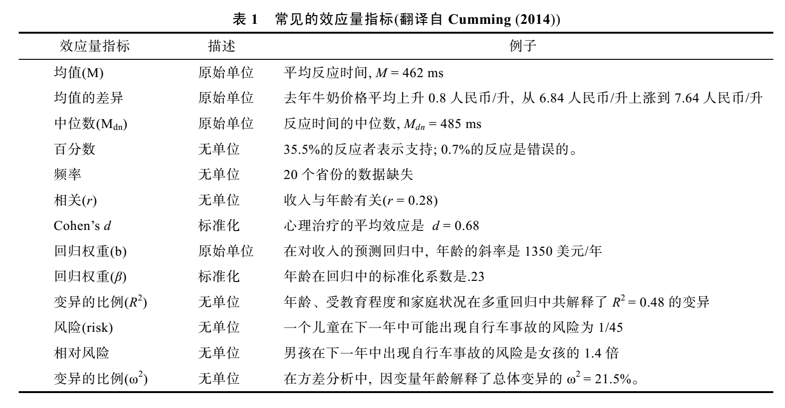
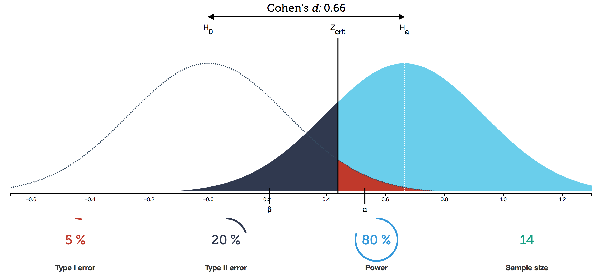

# 假设检验

[author]: # "Vonng (fengruohang@outlook.com)"
[tags]: # "统计，数学"
[mtime]: #	"2017-03-31 11:42 "
《心理统计——行为科学统计导论》第十章至末尾读书笔记，推断统计部分。

----

## 10.  假设检验

### 假设检验的逻辑 

假设检验的基本思想是：小概率反证法。假设检验的假设是关于总体的一个普遍性论断，这个检验是看从样本得出的结论能否推论到总体。

假设检验的基本逻辑是基于科学哲学的一个重要论点：**全称命题只能被否证而不能被证明**。这个道理很简单，个案当然不足以证明一个全称命题，但是却可以否定全称命题。

我们想证明的结论既然无法通过枚举个案来证明，那么就搞一个与原假设对立的虚无假设。原来的假设称为备择假设，备择假设与虚无假设二者必择其一。所以如果可以否证虚无假设，就曲线救国的证明了我们感兴趣的备择假设成立。

由于抽样的原因，样本并不可能绝对地否证虚无假设。在个案中，**小概率事件可以等同于不可能发生的事件**。我们在这个意义上去在一定的事先约定的概率水平（α）上去拒绝虚无假设。

##### 具体逻辑过程

1. 重复测量设计(repeat measures design)

   这种设计最基本的形式只包含两种条件：**实验条件**和**控制条件**。这两种条件中除了自变量外，其他因素要尽可能相同。是为控制变量法。

2. 提出备择假设($H_1$)

   任何实验中解释结果都要权衡两种假设：备择假设(Alternative hypothesis)与虚无假设(Null hypothesis)。

   * 备择假设$H_1$说明不同条件下的结果差异是自变量引发的。
   * 备择假设$H_1$是我们希望证明的假设。
   * 备择假设$H_1$可以是定向(directional)的或者非定向(nondirectional)的。 

3. 提出虚无假设($H_0$)

   * 虚无假设是备择假设的对立面，两者互斥且穷尽所有可能。
   * 虚无假设说明**不同条件下的结果差异是随机误差引起的**。
   * 仅存在随机因素时，事件发生的概率分布可以通过概率论知识计算。

4. 决定决策水平，显著性水平：α

   * 分析时，假设虚无假设为真，然后计算仅由随机因素导致该结果（或更极端结果）发生的概率p。
   * 如果$p\leα$水平的临界概率，就可以拒绝虚无假设，因为随机因素导致该结果发生的概率非常低。
   * 最常用的是$α = 0.05$或$α=0.01$。物理学上通常取$α=0.0000003$，即正态分布约5σ处。

5. 评估实验

### I类错误与II类错误

根据虚无假设做决策时，可能犯两种类型的错误。称为I型和II型错误

##### 定义：I型错误与II型错误

* I型错误(Type I error)指虚无假设$H_0$为真，却随机因素导致小概率事件发生，错误的拒绝了时出现的错误。
* II型错误(Type II error)指虚无假设$H_0$为假，却被接受时出现的错误。

| 决策                  | 保留$H_0$ （随机因素）          | 拒绝$H_0$（自变量有效）         |
| ------------------- | ----------------------- | ---------------------- |
| $H_0$为真（随机因素）$p_1$  | 正确决策，TN (1-α)           | I型错误，FP，错误的拒绝了$H_0$(α) |
| $H_0$为假（自变量有效）$p_2$ | II型错误，FN，错误的保留了$H_0$(β) | 正确决策，TP，(power = 1-β)  |

* α水平确定了犯I型错误的概率水平
* β水平确定了犯II型错误的概率水平
* p值**是当你假定没有效应时**，当前数据有多大的可能会出现。
* 决策原理是：我们人为地规定一个值（心理学中的0.05，物理学中的0.0000003），假如p值小于这个值，我们就认为可能是有效应的。
* $H0$为真($p_1$)为假$p_2$的概率，我们是不知道的。所能知道的只是当$H_0$为真，即只有随机因素作用时，出现当前结果模式的概率。即$P(D^*|H_0)$。不能根据p值推断出$H_0$为真的概率。因为以$H_0$为真作为条件时，当前数据模式的概率，不等于以当前数据模式作为条件，$H_0$为真的概率。

$$
P(D^*|H_0) \ne P(H_0|D^*)
$$

* p> 0.05也不能说明没有效应，有可能是效应比较小，需要更多的样本才能检测出效应。p < 0.05也只能说明自变量是**显著的**，即**这一因素不是由随机因素引起的**，有实际效应存在。但显著不等于重要：一个极其微小的差别影响通过海量样本被探测出来显著，很可能没什么卵用。知道某个效应有多大，比知道这个效应存在更有意义，这就引出的效应量的概念。

## 11.  检验力与效应量

##### 定义：实验检验力(the power of an experiment)

实验检验力被定义为：当自变量具有实际效应时，实验结果允许拒绝虚无假设的概率。

β定义为犯II型错误的概率，β=1-power。

##### 定义：效应量(effect size)，ES值

Cohen定义为：总体中存在某种现象的程度。定义较为宽松，可以是各种指标：

但总体而言一般具有三个特性：

* 尺度不变性(scale free)：观测单位发生变化不影响ES。
* 绝对值大小与效应强弱一致：取值应为从0开始的连续变量，当虚无假设为真时，ES理想估计值为0
* 非样本量依赖性：ES指标应较少受样本容量的影响。

##### 效应量与检验力有什么用？

**效应量ES、统计检验力power=(1-β)、α水平，样本量N，这四个变量相互关联，知道其中三个就可以推导出第四个。**由于在心理学研究中alpha水平通常被定为0.05，而统计检验力理论上越高越好，大多数实验的检验力值在40%~60%之间。80%已经非常理想。在这种情况下，α与统计检验力(1-β)都可以设定，所以如果知道效应量，就可以对研究所需要的样本量N进行估计。

为了设计实验，必须回答的问题就是，如何选择合适的样本数量N，毕竟样本获取也是有成本的能省则省。为了计算N，需要确定α水平，效应量(1-β水平)，效应量ES。但问题就来了，通常情况下，在实验前我们并不知道实验的效应量有多大（如果已经知道了还做个毛的实验）。这时候就需要利用先验知识或其他研究来确定一个预期的效应量大小。通常确定一个最小的实际预期效应，比如平均值的差值如果达到3就认为有效果，那就可以把效应量设为3，然后计算出所需的样本量N。

可视化演示：[NHST](http://rpsychologist.com/d3/NHST/)

* 如图所示，左侧为虚无假设下采样结果的分布，右侧为自变量有真实效应时的分布。
* 两个分布围曲线与坐标轴成的面积都为1。
* $z_{crit}$是根据α设定的决策临界值，它将$H_0$和$H_1$的分布各自划分为两个区域。
* 当自变量没有效果时，保留虚无假设。(其概率为p，没法推断)。此时样本实际从$H_0$分布中采样得到：
  * 红色拒绝域面积为α，如果$H_0$真的成立的话，结果落入此处的概率非常小。因此当结果落入红色区域时，我们认为小概率实际实际不可能发生，做出拒绝$H_0$，接受$H_1$的决策。
  * 但竟然真的因为随机因素产生这么极端的结果，I型错误就发生了，FP，发生概率为α。
  * 样本落在白色区域时，无法拒绝$H_0$。结果为TN，发生概率为1-α。
* 当自变量有实际效果时，拒绝虚无假设，此时样本实际从$H_1$分布采样得到：
  * 蓝色区域，代表拒绝了$H_0$，且做出正确的决策：TP，其面积等于检验力(statistic power)，1-β
  * 黑色区域，因为结果并不显著，做出了保留了$H_0$的决策，认为自变量没有效果。但实际上是因为随机因素，从$H_1$的分布中抽到了极端的结果，错误的保留了$H_0$，就犯了II型错误，FN，发生概率为β。
* 当样本量N增大时，比如平均数的采样分布方差就会缩小，采样的分布就越高瘦。
  * 此时如果α和β保持不变，则所需的效应量变小。
  * 如果待检测的效应量ES和决策水平alpha不变，则β减小，检验力提升。

